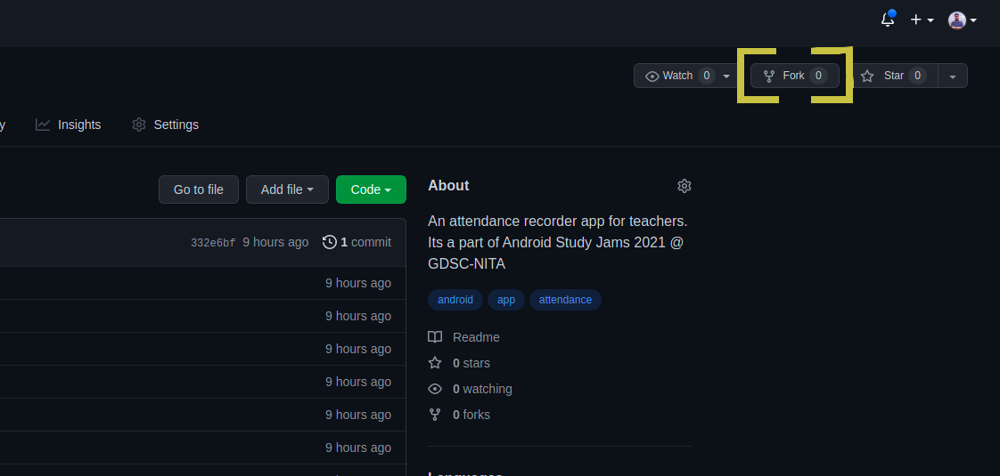
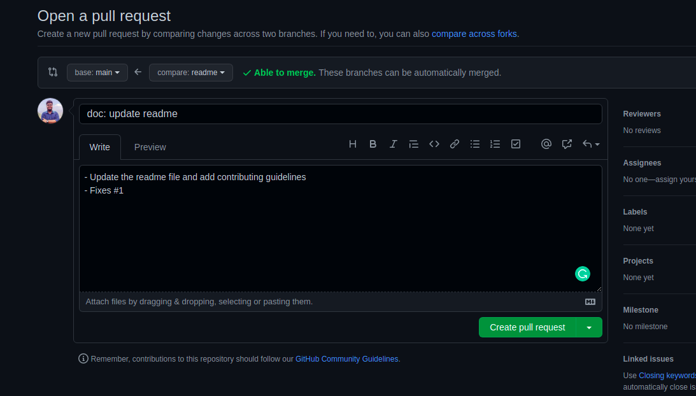

# Attendance-Pad

An attendance recorder app for teachers, build for Android using Kotlin. This project is a part of Andoird Study Jams 2021 @ GDSC-NITA.

# Contribution Guidelines

The team wants to make contributing to this project as easy as possible, whether it's:

* Reporting a bug 🐛
* Submitting a fix 🔎
* Proposing new features 💡

This doc contains a set of guidelines to help you during the contribution process. We are happy to welcome all the contributions from anyone willing to improve/add new features to this project.

## Prerequisites

* Download and install the latest version of [Git](https://git-scm.com/downloads).
* Create a [GitHub](https://github.com/join) account
* Download and install latest version of [Android Studio](https://developer.android.com/studio/downloads/index.html) / [VS Code](https://code.visualstudio.com/download)

## Project Set Up

1. Fork [this](https://github.com/DSC-NITA/attendancepad) repository



2. Clone the forked repository

```bash
git clone https://github.com/<your-github-username>/attendancepad.git
```

3. Navigate to the project directory

```bash
cd attendancepad
```

4. Add reference to the original repository

```bash
git remote add upstream https://github.com/DSC-NITA/attendancepad.git
```

5. Always take a pull from the upstream repository to your `main` branch to keep it at par with the main project(updated repository).

```bash
git pull upstream main
```

Once done with the above steps you are good to go for contributing. See the section below for more details.

## Contributing To The Project

1. Create a new branch (**DO NOT** name it MAIN or MASTER or anything random).

```bash
git checkout -b <your_branch_name>
```

2. Perfom your desired changes to the code base.

    * Make sure that you do not change any code unrelated to the task that you have been assigned
    * Preview your changes and test them properly before proceding ahead.

3. Add your changes to the project's version control

```bash
git add .
```

4. Commit your changes

```bash
git commit -m "Your commit message"
```

5. Push the committed changes in your feature branch to your remote repo.

```bash
git push -u origin <your_branch_name>
```

6. To create a pull request, click on `compare and pull requests`. Please ensure you compare your feature branch to the desired branch of the repo you are suppose to make a PR to.


7. Then add an appropriate title and description to your pull request that explains your changes and efforts done.

8. Click on `Create Pull Request`.

    * Make sure to refer the respective issue in the respective PR using phrases like Resolves #issue_number or Closes #issue_number or Fixes #issue_number. Here's an example to raise a PR:

```markdown
 Fixes #21

# Work Done:

- Fixed home-page renderning and jagging issue
- ...
- ...
- ...

# Relevant Screenshots/Gifs
```



9. Wo-Hoo!! You have made an PR to the attendance-pad app. Sit back and relax while the maintainers review the PR.
